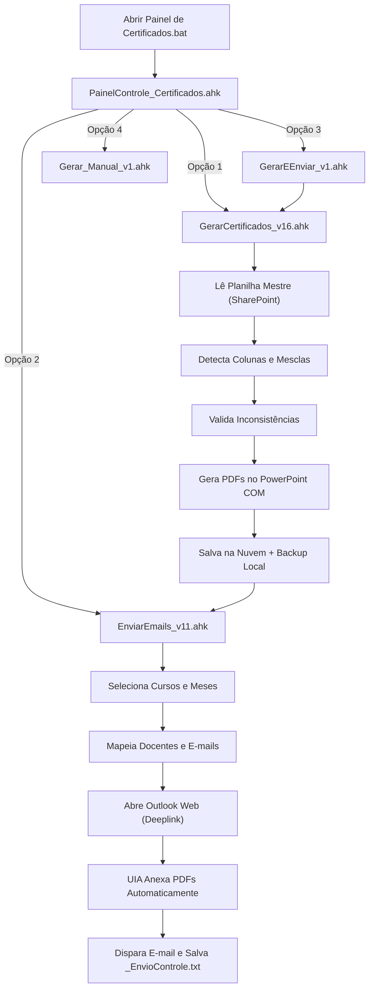

#  Central de Automação de Certificados — Pós-Graduação

Sistema integrado de automação em AutoHotkey v2 para geração em lote de certificados em PDF e envio automatizado de e-mails para o corpo docente através do Outlook Web via Microsoft UI Automation.

# Principais Recursos

- Anexação 100% Automática no Outlook Web (`EnviarEmails_v11.ahk`):
  - Conexão nativa com Microsoft Edge e Google Chrome através de UI Automation.
  - Localiza os certificados de cada docente e anexa sem intervenção manual de mouse/arrastar.
  - Dois modos de disparo: Supervisionado (conferência visual rápida + tecla `ENTER`) ou Modo Turbo (autônomo).
  - Controle persistente de envios (`_EnvioControle.txt`) para evitar duplicações e permitir pausas/retomadas seguras.

- Geração em Lote Inteligente (`GerarCertificados_v16.ahk`):
  - Localização dinâmica e leitura da Planilha Mestre (*Controle de Declaração de Aula*) no SharePoint/OneDrive corporativo.
  - Detecção Automática de Colunas na Linha 3 (localiza onde estão docentes, disciplinas e horários sem necessidade de informar letras de colunas).
  - Tratamento nativo de células mescladas verticais e horizontais do Excel.
  - Preenchimento em lote no PowerPoint COM e exportação direta em PDF de alta qualidade.
  - Armazenamento espelho: salva no SharePoint/OneDrive corporativo e mantém backup organizado em `C:\Certificados\<Curso>\<MM.AA>\` e `C:\Certificados\<Curso>\Docentes\<Nome>\`.

- Módulos Complementares e Utilitários:
  - `PainelControle_Certificados.ahk`: Central visual unificada com atalhos, diagnósticos e status de ambiente.
  - `GerarEEnviar_v1.ahk`: Esteira contínua (executa a geração em lote e segue imediatamente para a fila de envio).
  - `Gerar_Manual_v1.ahk`: Emissão individual ou correção rápida de certificados avulsos.
  - `Gerar_Extraordinarios_v2.ahk`: Assistente interativo para planilhas personalizadas fora do formato padrão.
  - `UI_Moderna.ahk`: Biblioteca gráfica padronizada (Segoe UI, paleta corporativa `#003366`, diálogos modernos).

---

 📁 Estrutura do Projeto

```text
CertificadosPosGraduacao/
├── .gitignore                      # Regras para ignorar planilhas, logs e PDFs gerados
├── README.md                       # Documentação técnica e guia de uso
├── Abrir Painel de Certificados.bat# Inicializador rápido por duplo clique
├── PainelControle_Certificados.ahk # Central visual principal do ecossistema
├── GerarCertificados_v16.ahk       # Geração em lote via SharePoint + PowerPoint COM
├── EnviarEmails_v11.ahk            # Envio automatizado no Outlook Web (UI Automation)
├── GerarEEnviar_v1.ahk             # Orquestrador do fluxo completo (Gerar + Enviar)
├── Gerar_Manual_v1.ahk             # Emissor manual e correções individuais
├── Gerar_Extraordinarios_v2.ahk    # Assistente para planilhas extraordinárias
├── UI_Moderna.ahk                  # Componentes visuais e localizador dinâmico de nuvem
└── Lib/
    ├── UIA.ahk                     # Microsoft UI Automation Wrapper para AHK v2
    └── UIA_Browser.ahk             # Automação de navegadores (Edge/Chrome) para Outlook Web
```

---

 Pré-Requisitos

1. AutoHotkey v2.0+ instalado no Windows.
2. Microsoft PowerPoint (instalado localmente para o COM Object).
3. Microsoft Edge com acesso autenticado ao Outlook Web (`outlook.office.com`).
4. Acesso ao diretório de assinaturas dos coordenadores (`C:\CAssinaturas\` ou SharePoint corporativo).

---

 Como Executar

Método 1: Pelo Lançador Rápido (Recomendado)
Dê um duplo clique no arquivo:
```text
Abrir Painel de Certificados.bat
```

 Método 2: Executar Diretamente o Script Desejado
- Painel Central: `PainelControle_Certificados.ahk`
- Apenas Gerar Certificados: `GerarCertificados_v16.ahk`
- Apenas Enviar E-mails: `EnviarEmails_v11.ahk`
- Fluxo Contínuo: `GerarEEnviar_v1.ahk`

---

#Fluxo de Trabalho Típico



---

 Boas Práticas e Segurança de Dados

- As planilhas com dados de docentes (`.xlsx`), arquivos de controle (`_EnvioControle.txt`) e certificados gerados (`.pdf`) estão inclusos no `.gitignore` para garantir total privacidade e conformidade com a LGPD e políticas corporativas.
- Ao subir o projeto no **GitHub**, apenas os códigos-fonte (`.ahk`), bibliotecas auxiliares (`Lib\`) e o arquivo de lote inicializador (`.bat`) serão enviados.

---

## 👨‍💻 Desenvolvido com AutoHotkey v2 (E apoio de ferramentas de Inteligencia Artifical)
Criado para otimizar o processo acadêmico de emissão e distribuição de declarações e certificados de docentes da pós-graduação.
